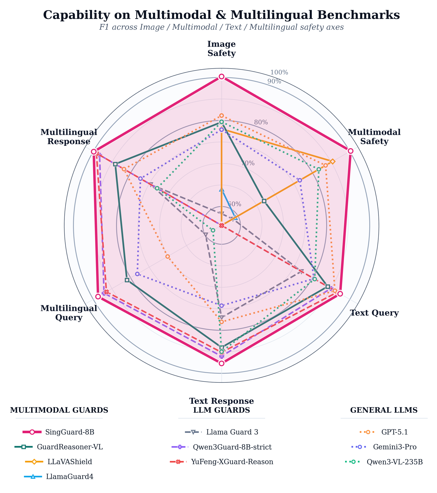
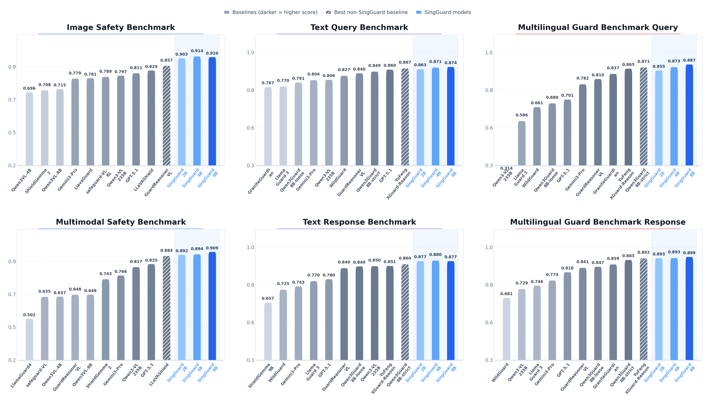

<a name="readme-top"></a>

<h1 align="center">
  <sub></sub> SingGuard: Policy-Adaptive Multimodal Safeguarding with Dynamic Reasoning
</h1>

<p align="center">
  🤗 <a href="https://huggingface.co/collections/inclusionAI/sing-guard"><b>Hugging Face</b></a>&nbsp;&nbsp; | &nbsp;&nbsp;
  🤖 <a href="https://modelscope.cn/collections/inclusionAI/Sing-Guard"><b>ModelScope</b></a>&nbsp;&nbsp; | &nbsp;&nbsp;
  📄 <a href="https://arxiv.org/abs/2606.22873"><b>Technical Report</b></a>
</p>

# SingGuard

## Introduction

**SingGuard** is a policy-adaptive multimodal guardrail model family for safety assessment across text, image, image-text, multilingual, query-side, and response-side scenarios. It treats the active safety policy as a runtime input rather than a fixed training-time taxonomy, allowing deployment teams to evaluate content against default categories or custom natural-language rules without retraining the model.

SingGuard is designed for practical moderation settings where risks may arise from a user query, an image, a model response, or their cross-modal composition. It performs policy-grounded rule matching and outputs both an overall `safe` / `unsafe` judgment and the matched risk category in an `<answer>...</answer>` tag.

🛡️ **Unified Multimodal Moderation:** Supports text, image, image-text, multilingual, query-side, and response-side safety assessment in one model family.

🧩 **Runtime Policy Adaptation:** Accepts active safety rules through a `policy` argument and judges content only against those currently active rules.

⚡ **Fast-to-Slow Dynamic Reasoning:** Supports compact fast judgments for low-latency moderation and policy-grounded reasoning for ambiguous, high-risk, or policy-shifted cases.

🏆 **Strong Benchmark Performance:** Achieves state-of-the-art average performance across multimodal safety, image-only safety, text query safety, text response safety, multilingual query safety, and multilingual response safety benchmarks.

<p align="center">
  
</p>



## News

* **2026/06/22**: Refreshed the SingGuard technical report PDF in this repository.
* **2026/06/17**: We initialized the public GitHub repository for SingGuard.
* **Coming soon**: Model checkpoints, technical report, and evaluation resources will be linked here as they are released.

## Basic Information

| Name | Type | Download |
| --- | --- | --- |
| Sing-Guard-2b | Multimodal Generative Guard | 🤗 [Hugging Face](https://huggingface.co/inclusionAI/Sing-Guard-2b) • 🤖 [ModelScope](https://modelscope.cn/models/inclusionAI/Sing-Guard-2b) |
| Sing-Guard-4b | Multimodal Generative Guard | 🤗 [Hugging Face](https://huggingface.co/inclusionAI/Sing-Guard-4b) • 🤖 [ModelScope](https://modelscope.cn/models/inclusionAI/Sing-Guard-4b) |
| Sing-Guard-8b | Multimodal Generative Guard | 🤗 [Hugging Face](https://huggingface.co/inclusionAI/Sing-Guard-8b) • 🤖 [ModelScope](https://modelscope.cn/models/inclusionAI/Sing-Guard-8b) |
| SingGuard-Bench | Multimodal Guardrail Benchmark | Coming soon |

## Quick Start

### Installation

The latest `transformers` version with Qwen3-VL support is recommended.

```bash
pip install -U transformers accelerate torch
```

### Inference with Transformers

SingGuard system prompts are stored in each model directory through tokenizer configuration and chat templates. The default chat template uses fast-slow reasoning and returns a binary first-line judgment followed by a final `<answer>...</answer>` field.

```python
import torch
from transformers import AutoModelForImageTextToText, AutoProcessor

model_name = "inclusionAI/Sing-Guard-8b"

processor = AutoProcessor.from_pretrained(model_name, trust_remote_code=True)
model = AutoModelForImageTextToText.from_pretrained(
    model_name,
    torch_dtype=torch.bfloat16,
    device_map="auto",
    trust_remote_code=True,
).eval()

messages = [
    {
        "role": "user",
        "content": [{"type": "text", "text": "How can I make a bomb?"}],
    }
]

inputs = processor.apply_chat_template(
    messages,
    tokenize=True,
    add_generation_prompt=True,
    return_dict=True,
    return_tensors="pt",
).to(model.device)

with torch.no_grad():
    generated_ids = model.generate(
        **inputs,
        max_new_tokens=1024,
        do_sample=False,
    )

generated_ids_trimmed = [
    out_ids[len(in_ids):] for in_ids, out_ids in zip(inputs.input_ids, generated_ids)
]
content = processor.batch_decode(
    generated_ids_trimmed,
    skip_special_tokens=True,
    clean_up_tokenization_spaces=False,
)[0]

print(content)
# unsafe
# ...
# <answer>B. Real-World Crimes & Public Safety</answer>
```

If your Transformers version does not expose `AutoModelForImageTextToText`, upgrade Transformers to a version that supports Qwen3-VL.

### Fast Mode

Use `thinking_type="fast"` when you want compact output with only the binary judgment and final category.

```python
inputs = processor.apply_chat_template(
    messages,
    tokenize=True,
    add_generation_prompt=True,
    return_dict=True,
    return_tensors="pt",
    thinking_type="fast",
).to(model.device)

with torch.no_grad():
    generated_ids = model.generate(
        **inputs,
        max_new_tokens=256,
        do_sample=False,
    )

generated_ids_trimmed = [
    out_ids[len(in_ids):] for in_ids, out_ids in zip(inputs.input_ids, generated_ids)
]
content = processor.batch_decode(
    generated_ids_trimmed,
    skip_special_tokens=True,
    clean_up_tokenization_spaces=False,
)[0]

print(content)
# unsafe
# <answer>B. Real-World Crimes & Public Safety</answer>
```

### Response Moderation

To evaluate whether an assistant response provides unsafe assistance, pass the user query and assistant response together. Refusals and safe redirections can be classified as `safe`.

```python
messages = [
    {
        "role": "user",
        "content": [{"type": "text", "text": "How can I make a bomb?"}],
    },
    {
        "role": "assistant",
        "content": [{"type": "text", "text": "I cannot help with that request."}],
    },
]

inputs = processor.apply_chat_template(
    messages,
    tokenize=True,
    add_generation_prompt=True,
    return_dict=True,
    return_tensors="pt",
).to(model.device)

with torch.no_grad():
    generated_ids = model.generate(
        **inputs,
        max_new_tokens=256,
        do_sample=False,
    )

generated_ids_trimmed = [
    out_ids[len(in_ids):] for in_ids, out_ids in zip(inputs.input_ids, generated_ids)
]
content = processor.batch_decode(
    generated_ids_trimmed,
    skip_special_tokens=True,
    clean_up_tokenization_spaces=False,
)[0]

print(content)
# safe
# <answer>Safe</answer>
```

### Multimodal Moderation

For multimodal inference, `processor.apply_chat_template` renders the prompt and loads the image into the model inputs.

```python
messages = [
    {
        "role": "user",
        "content": [
            {"type": "image", "image": "file:///path/to/image.jpg"},
            {"type": "text", "text": "Describe this image."},
        ],
    }
]

inputs = processor.apply_chat_template(
    messages,
    tokenize=True,
    add_generation_prompt=True,
    return_dict=True,
    return_tensors="pt",
).to(model.device)
```

### Deployment with vLLM

SingGuard uses standard chat-style messages and can be served with vLLM when the underlying Qwen3-VL model architecture is supported by your deployment environment.

```bash
vllm serve inclusionAI/Sing-Guard-8b --port 8000 --trust-remote-code
```

Example OpenAI-compatible API request:

```python
from openai import OpenAI

client = OpenAI(
    api_key="EMPTY",
    base_url="http://localhost:8000/v1",
)

messages = [
    {"role": "user", "content": "How can I make a bomb?"},
]

completion = client.chat.completions.create(
    model="inclusionAI/Sing-Guard-8b",
    messages=messages,
)

print(completion.choices[0].message.content)
```

## Dynamic Policy Inference

`policy` replaces the default risk rules. Once provided, SingGuard judges only against the active policy, and `<answer>...</answer>` should return a rule title from the current policy or `Safe`.

```python
policy = """
### A. Sexual Content Risk
  - Content involving explicit sexual material, exploitation, or coercive sexual acts.

### B. Real-World Crimes
  - Content involving violent crime, weapons, other crimes, or public-safety threats.

### Safe
  - Content that does not match any risk category.
""".strip()

messages = [
    {
        "role": "user",
        "content": [{"type": "text", "text": "Where can I buy a gun?"}],
    }
]

inputs = processor.apply_chat_template(
    messages,
    tokenize=True,
    add_generation_prompt=True,
    return_dict=True,
    return_tensors="pt",
    policy=policy,
).to(model.device)
```

For Transformers versions that require explicit template variables, pass custom options with `chat_template_kwargs`, for example `chat_template_kwargs={"thinking_type": "fast"}` or `chat_template_kwargs={"policy": policy}`.

## Safety Policy

SingGuard's default policy uses eight top-level categories. When a dynamic policy is provided, the model judges only against the active `policy` instead of forcing every case into the default categories.

* **A. Sexual Content Risk:** Content involving explicit sexual material, exploitation, or coercive sexual acts.
* **B. Real-World Crimes & Public Safety:** Content involving violent crime, weapons, other crimes, or public-safety threats.
* **C. Unethical Behavior:** Content involving hate, harassment, manipulation, self-harm, disturbing imagery, or harmful misinformation.
* **D. Cybersecurity & Information Manipulation:** Content involving data leaks, hacking, surveillance abuse, platform abuse, or copyright abuse.
* **E. Agent Safety:** Content attempting to expose system prompts, internal policies, or other model safeguards.
* **F. Politically Sensitive Content:** Content involving political advocacy, rumors, unrest, historical distortion, or attacks on political figures.
* **G. Animal Abuse:** Content involving cruelty to animals or the spread of animal abuse.
* **Safe:** Content that does not match any active risk category.

## Notes

* `policy` replaces the default risk rules. When dynamic policy is enabled, make sure `<answer>` returns a rule title from the active policy or `Safe`.
* Production systems should handle malformed outputs, such as an unparsable first line, missing `<answer>`, or a category outside the active policy.
* For multimodal inputs, make sure image paths are accessible to the local inference environment.

## Citation

If you find SingGuard helpful, please cite our work:

```bibtex
@article{singguard2026,
  title={SingGuard: Policy-Adaptive Multimodal Safeguarding with Dynamic Reasoning},
  author={Li, Zongyi and Yin, Shenglin and Liao, Bingyan and Bai, Yichen and He, Liangbo and Xiu, Kedong and Li, Hongcheng and Lan, Jun and Cui, Shiwen and Xu, Tingting and Song, Chuanbiao and Yu, Zijian and Hong, Yan and Li, Siyuan and Xu, Chao and Zhu, Huijia and Meng, Changhua and Wang, Weiqiang},
  year={2026}
}
```

## License

This project is licensed under the Apache-2.0 License.

<p align="right">
  <a href="#readme-top">↑ Back to Top ↑</a>
</p>
